## Redmine + MailServer(SMTP/POP3/IMAP) + WebMailClient + OpenLDAP
Redmineの動作確認用のdocker-composeです。  
メールサーバとLDAPの連携がどうしてもうまくいかなかったので、それぞれ個別にユーザ登録する形にしています。  
実運用では利用しないでください。

### 起動
下記コマンドにてdockerを起動

```
docker-compose up -d
```

### Redmine初期データセットアップ
dockerの起動が完了したら、下記コマンドでRedmineの初期データをセットアップ

```
docker exec redmine bundle exec rake redmine:load_default_data RAILS_ENV=production REDMINE_LANG=ja
```

### RainLoop初期セットアップ
#### 1. RainLoop管理画面アクセス
下記URLにアクセスする（アカウント：admin/12345）

```
http://[docker起動ホスト]:3001/?admin
```

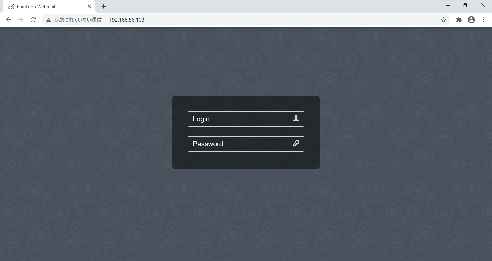

#### 2. 日本語化
言語を日本語化する  
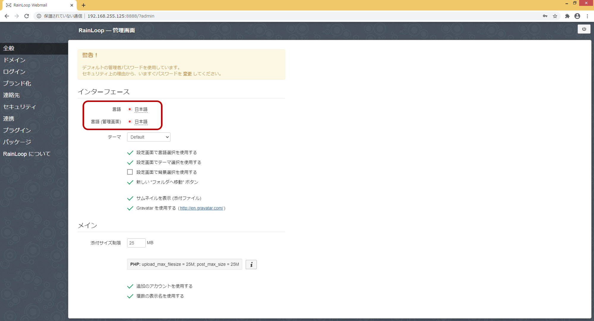

#### 3. ドメイン登録
ドメインメニューより、既存の設定を全て削除する。  
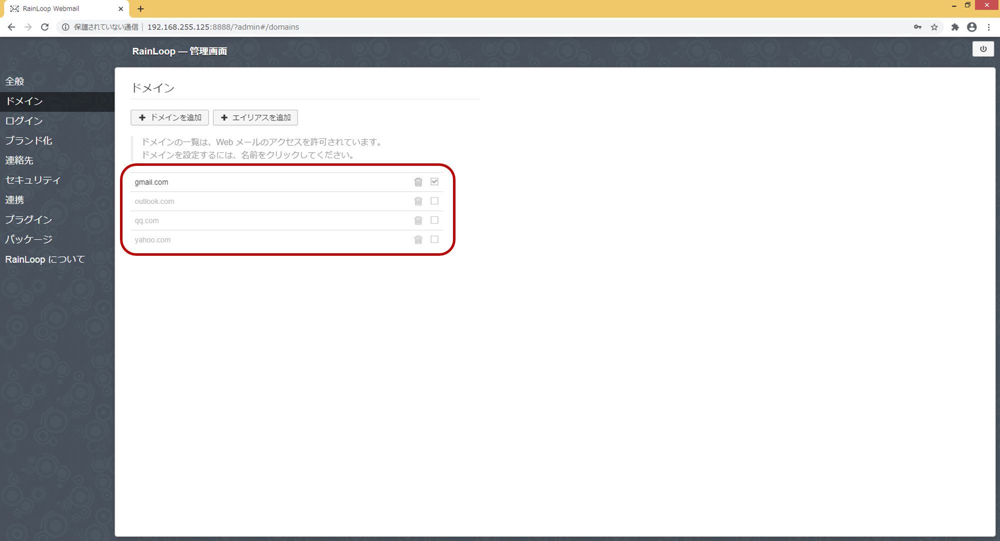

「ドメインを追加」ボタンより、ドメインを追加する。  
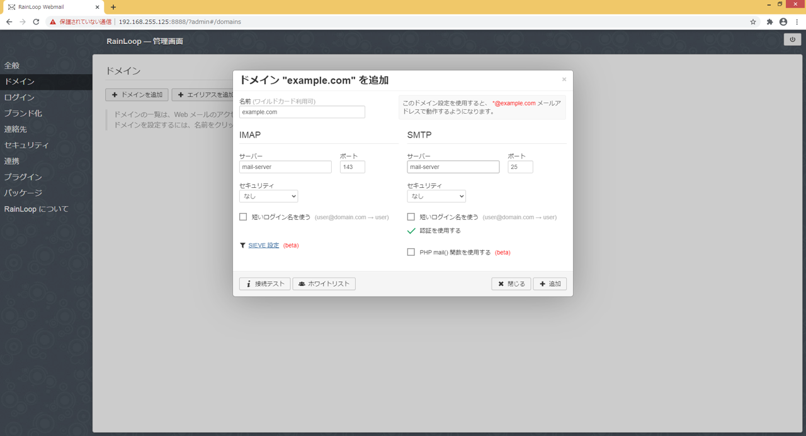

| パラメタ | ドメイン1 | ドメイン2 |
|:----|:----|:----|
| 名前 | example.com| example.net |
| IMAPサーバー | mail-server | mail-server |
| IMAPポート | 143 | 143 |
| SMTPサーバー | mail-server | mail-server |
| SMTPポート | 25 | 25 |

#### 4. WebMailログイン確認
下記URLにアクセスする。  
mail-serverのpostfix-accounts.cfに定義したアカウントでログインできることを確認する。

```
http://[docker起動ホスト]:3001
```

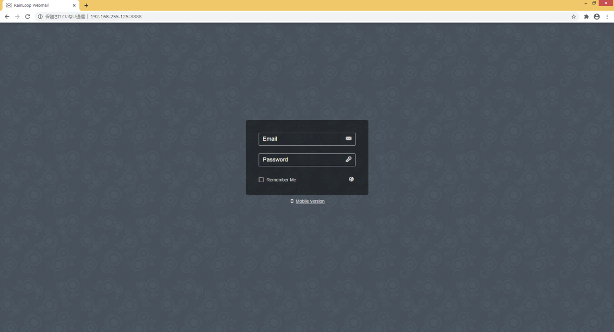

test01@example.comでログインした画面  
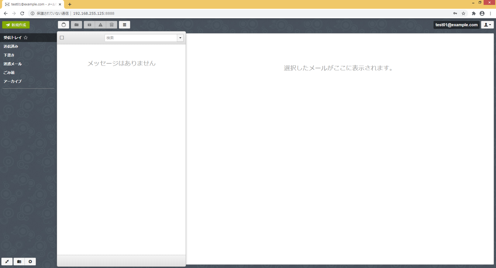

### OpenLDAP確認
下記URLにアクセスする。  
Login DN : cn=admin,dc=example,dc=com
Password : password


```
http://[docker起動ホスト]:3002
```
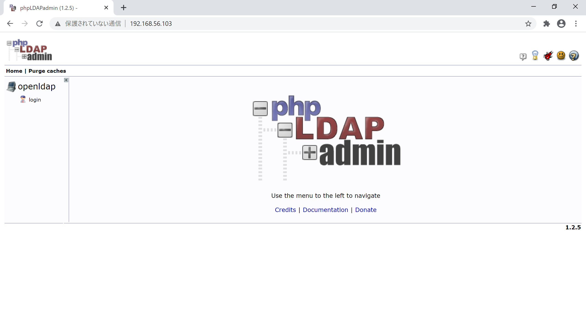

init.ldifにて定義したユーザが登録されていることを確認する  
init.ldifのアカウントパスワードはすべて "password"  
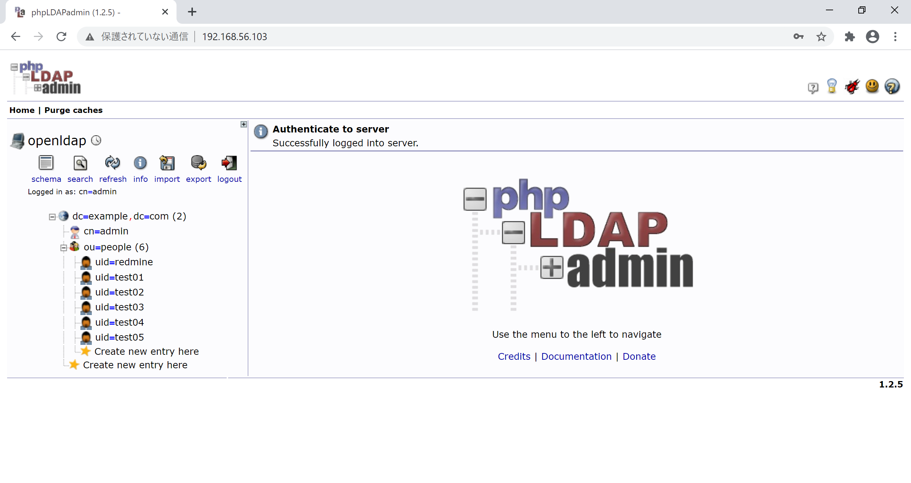


### Redmine表示確認
下記URLにアクセスする。初期パスワードは admin/admin

```
http://[docker起動ホスト]:3000
```
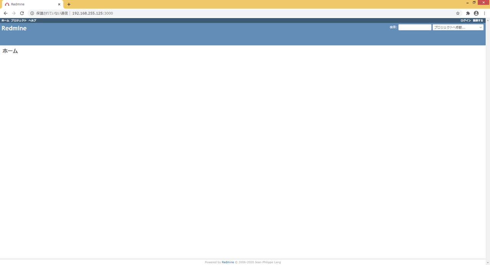

#### LDAP登録
RedmineのLDAP認証からLDAPサーバを登録する  
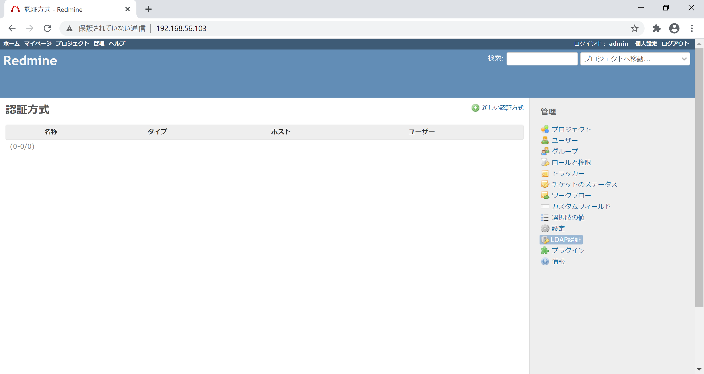

| パラメタ | 値 |
|:----|:----|
| 名前 | example.com|
| ホスト | mail-server |
| ポート | 389 |
| アカウント | cn=admin,dc=example,dc=com |
| パスワード | password |
| ベースDN | ou=people,dc=example,dc=com |
| ログインIDの属性 | cn |
| 名の属性 | givenName |
| 性の属性 | sn |
| メールアドレスの属性 | mail |
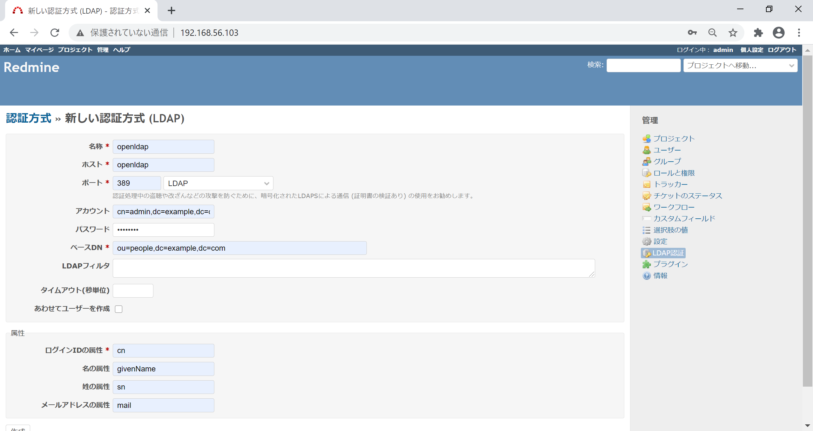

### メール読込コマンド

```
docker exec redmine bundle exec rake redmine:email:receive_imap RAILS_ENV="production" host=mail-server username=redmine@example.com password=password unknown_user=ignore allow_override=all
```

### 参考
参考にしたのは以下

Jaybanuan's Blog "RedmineをDocker Composeで構築"  
https://redj.hatenablog.com/entry/2020/02/19/081344

かんがるーさんの日記 "( その２５ )"  
https://ksby.hatenablog.com/entry/2018/08/28/021140

かんがるーさんの日記 "( その２８ )"  
https://ksby.hatenablog.com/entry/2019/01/05/225907

docker上にRedmine、gitlabのopenLDAP認証環境を構築  
https://qiita.com/ir-shin1/items/12d0dbea40d1f1f06747